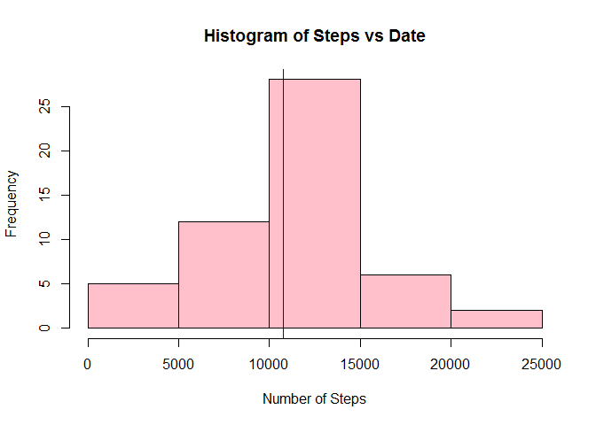
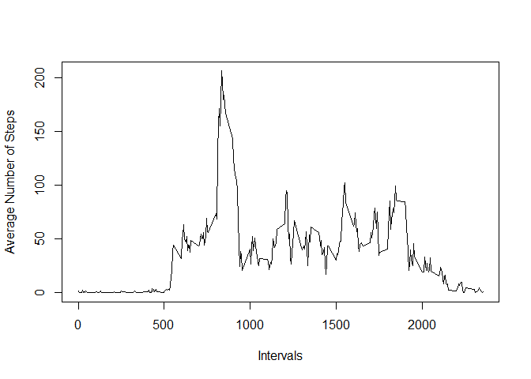
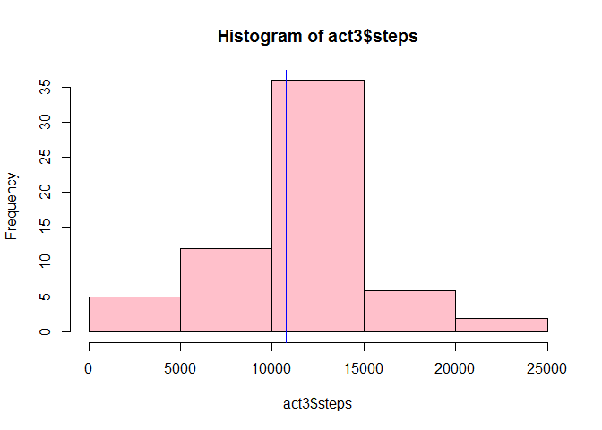
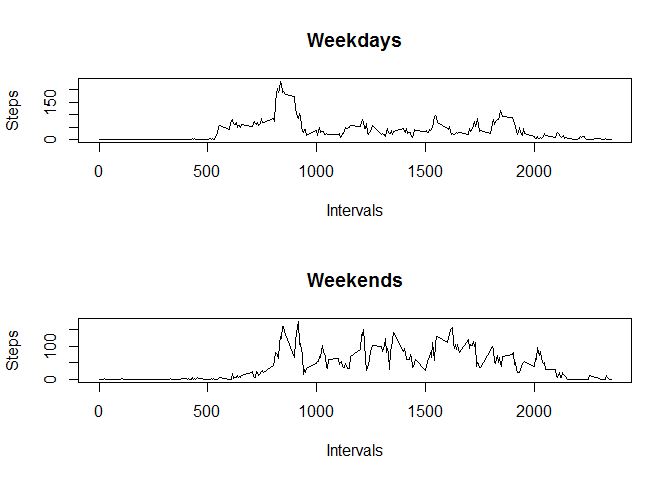

# Reproducible Research: Peer Assessment 1


## Loading and preprocessing the data

Download the dataset from:

https://d396qusza40orc.cloudfront.net/repdata%2Fdata%2Factivity.zip

and save it into your working directory. Then, read the dataset using the following code:


```r
act <- read.csv("activity.csv")
```

## What is mean total number of steps taken per day?


```r
act1<-act[!is.na(act$steps),]
act1<-aggregate(steps ~ date, data=act1 ,sum)
hist(act1$steps,main = "Histogram of Steps vs Date" ,xlab= "Number of Steps" ,col = "pink")
abline(v = mean(act1$steps), col="red")
abline(v = median(act1$steps), col="blue")
```

 

To calculate the mean and median:

```r
mean(act1$steps)
```

```
## [1] 10766.19
```

```r
median(act1$steps)
```

```
## [1] 10765
```
It follows that mean = 10766.19 and median = 10765.


## What is the average daily activity pattern?

We can plot the graph of the dayily activity pattern using the following code:

```r
act1<-act[!is.na(act$steps),]
act2<- aggregate(steps ~ interval, data = act1, mean)
with(act2, plot(interval, steps, type="l", xlab = "Intervals", ylab = "Average Number of Steps"))
```

 

The maximum average step across intervals is 206.1698:


```r
max(act2$steps)
```

```
## [1] 206.1698
```
And in happens in the interval=835:


```r
act2[act2$steps>206,]
```

```
##     interval    steps
## 104      835 206.1698
```

## Imputing missing values
Total number of missing values:


```r
act1<-act[!is.na(act$steps),]
NumOfMissValues<- nrow(act)-nrow(act1)
NumOfMissValues
```

```
## [1] 2304
```

I will use the median of steps per day (as was calculated above) to fill the NAs.


```r
act3<-tapply(act$steps, act$date, sum)
act3<-as.data.frame(act3)
act3[is.na(act3)]<- 10765
colnames(act3) <- "steps"
head(act3)
```

```
##            steps
## 2012-10-01 10765
## 2012-10-02   126
## 2012-10-03 11352
## 2012-10-04 12116
## 2012-10-05 13294
## 2012-10-06 15420
```

The new histogram will be:


```r
hist(act3$steps, col = "pink")
abline(v = mean(act3$steps), col="red")
abline(v = median(act3$steps), col="blue")
```

 

Although the total amount of days with 10000-15000 steps is increased (because we just replaced all the NA values with 10765 which falls in this interval), the new median and mean are almost the same as before:


```r
mean(act3$steps)
```

```
## [1] 10766.03
```


```r
median(act3$steps)
```

```
## [1] 10765
```


## Are there differences in activity patterns between weekdays and weekends?


```r
act4<-cbind(date = row.names(act3), act3)
act4<-cbind(act4, weekday=weekdays(as.Date(act4$date)))
head(act4)
```

```
##                  date steps   weekday
## 2012-10-01 2012-10-01 10765    Monday
## 2012-10-02 2012-10-02   126   Tuesday
## 2012-10-03 2012-10-03 11352 Wednesday
## 2012-10-04 2012-10-04 12116  Thursday
## 2012-10-05 2012-10-05 13294    Friday
## 2012-10-06 2012-10-06 15420  Saturday
```


```r
act4$weekday<-as.character(act4$weekday)
act4$weekday[act4$weekday %in% c("Saturday" , "Sunday")]<- "weekend"
act4$weekday[!(act4$weekday %in% c("weekend"))]<- "weekday"

head(act4, n = 14)
```

```
##                  date steps weekday
## 2012-10-01 2012-10-01 10765 weekday
## 2012-10-02 2012-10-02   126 weekday
## 2012-10-03 2012-10-03 11352 weekday
## 2012-10-04 2012-10-04 12116 weekday
## 2012-10-05 2012-10-05 13294 weekday
## 2012-10-06 2012-10-06 15420 weekend
## 2012-10-07 2012-10-07 11015 weekend
## 2012-10-08 2012-10-08 10765 weekday
## 2012-10-09 2012-10-09 12811 weekday
## 2012-10-10 2012-10-10  9900 weekday
## 2012-10-11 2012-10-11 10304 weekday
## 2012-10-12 2012-10-12 17382 weekday
## 2012-10-13 2012-10-13 12426 weekend
## 2012-10-14 2012-10-14 15098 weekend
```


```r
act5<-cbind(act1, weekday=weekdays(as.Date(act1$date)))
act5$weekday<-as.character(act5$weekday)
act5$weekday[act5$weekday %in% c("Saturday" , "Sunday")]<- "weekend"
act5$weekday[!(act5$weekday %in% c("weekend"))]<- "weekday"

act5<- aggregate(steps ~ interval + weekday, data = act5 , mean)

par(mfrow= c(2,1))
act5_weekday <- subset(act5, act5$weekday == "weekday")
act5_weekend <- subset(act5, act5$weekday == "weekend")
plot(act5_weekday$interval, act5_weekday$steps, type = "l" , main = "Weekdays", xlab = "Intervals", ylab = "Steps")
plot(act5_weekend$interval, act5_weekend$steps, type = "l", main = "Weekends", xlab = "Intervals", ylab = "Steps")
```

 


